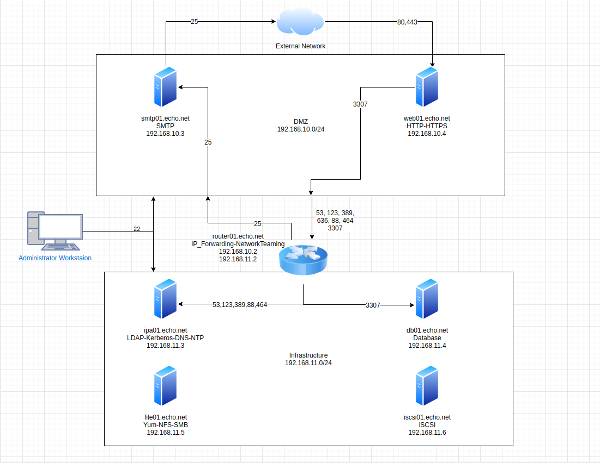

# RHEL Network Services - Self-Study
In my new job, I am tasked with installing, configuring, and maintaining several network sevices on Red Hat Enterprise Linux 7 (RHEL7).  To get a deeper undersanding of these network services I have created some [generalized notes](#rhel-network-services-notes) and a [lab](#rhel-network-services-lab) environment.

The [notes](#rhel-network-services-notes) section provides step-by-step instrucitons for configuring some common scenarios for each service.  The following services are covered: DNS, LDAP, KERBEROS, NTP, SMTP, iSCSI, NFS, SMB, Network Teaming, HTTP/HTTPS, and Database.

The [lab](#rhel-network-services-lab) environment demonstrates a practical application for many of the services listed above.  It consists of seven CentOS7 servers as shown in the network diagram below. (The router is also CentOS7)  Similar to my workplace, in this lab, the services span multiple subnets and supports an N-Tiered application.  A step-by-step guide to setting up the lab environment can be found [here](Lab/Configuration-Guide.md).

# RHEL Network Services Notes
Below are a generalized list of notes that cover common configuration scenarios for each service.  In these notes, anything written in <THIS_NOTATION> needs to be changed to suite the environment.

## ISCSI
1. [Configure a system as an iSCSI target](ISCSI/1.iSCSI_Target.md)
2. [Configura a system as an iSCSI initiaitor.](ISCSI/2.iSCSI_Initiator.md)

## HTTP/HTTPS
1. [Configure a virtual host.](HTTP-HTTPS/1.VirtualHost.md)
2. [Configure access restrictions on directories.](HTTP-HTTPS/2.AccessRestrictions.md)
3. [Deploy a basic CGI application.](HTTP-HTTPS/3.CGI.md)
4. [Configure TLS Security.](HTTP-HTTPS/5.TLS.md)

## DNS
1. [Configure a caching-only name server.](DNS/1.CachingOnly.md)
2. [Troubleshoot DNS client issues.](DNS/2.Troubleshooting.md)

## NFS
1. [Provide network shares to specific clients.](NFS/1.NFSforClients.md)
2. [Provide network shares suitable for group collaboration.](NFS/1.NFSforClients.md)
3. [Use kerberos to control access to NFS network shares.](NFS/3.KerberizedNFS.md)

## SMB
1. [Provide network shares to specific clients.](SMB/1.NetSharesForClients.md)
2. [Provide network shares suitable for group collaboration.](SMB/2.NetSharesForGroups.md)

## SMTP
1. [Configure a system to forward all email to a central mail server.](SMTP/1.FwdAllMail.md)

## NTP
1. [Syncronize time using other NTP peers.](NTP/1.SyncTime.md)

## Database Services
1. [Install and configure MariaDB.](DB/1.InstallConfigure.md)
2. [Backup and restore a database.](DB/2.BackupRestore.md)
3. [Create a simple database schema.](DB/3.CreateSchema.md)
4. [Perform simple SQL queries against a database.](DB/4.Queries.md)

## System Configuration and Management
Configuring these Network Services on a system often involves manipulating the system's network connections, firewall, SELinux policies, etc.  The notes for these ancillary skills have been put into this section.

1. [Use network teaming or bonding to configure aggregated network links between two Red Hat Enterprise Linux systems.](SysConfigMgmt/1.NetworkTeaming.md)
2. [Configure IPv6 addresses and ferform basic IPv6 troubleshooting.](SysConfigMgmt/2.IPv6.md)
3. [Route IP traffic and create static routes.](SysConfigMgmt/3.Routes.md)
4. [Use firewalld and associated mechanisms such as rich rules, zones, and custom rules to implement packet filtering and configure network address translation (NAT).](SysConfigMgmt/4.FirewallRules.md)
5. [Configure a system to authenticat using Kerberos.](SysConfigMgmt/5.Kerberos.md)
6. [Produce and deliver reports on system utilization (processor, memory, disk and netowrk).](SysConfigMgmt/6.SAR.md)
7. [Configure SELinux to support the service.](SysConfigMgmt/7.SELinux-SupportServices.md)
8. [Use SELinux port labeling to allow services to use non-standard ports.](SysConfigMgmt/8.SELinux-NonStandardPort.md)

Another excellent resource is the [RootUsers](https://www.rootusers.com/red-hat-certified-engineer-rhce-7-ex300-study-guide/) website.  

# RHEL Network Services Lab
The lab environment consists of seven CentOS7 servers.  Being a lab environment, there aren't any connections to external networks and many of the servers serve more than one purpose.  A short description of each server and its functions can be found below.

Step-by-step setup instrucitons for configuring this lab environment can be found in the **[Configuration Guide](Lab/Configuration-Guide.md)**.

## [file01.echo.net](Lab/VM-Specs/file01.echo.net.md)
- Provide packages via http **yum repository**
- Serve files via **Kerberized NFS**
- Serve files via **SMB**

## [ipa01.echo.net](Lab/VM-Specs/ipa01.echo.net.md)
- Provide **LDAP** Authentication and **Kerberos** Authorization via **IPA**
- Authoritative **DNS** Server for `echo.net` via IPA
- **NTP** (Network Time Protocol) server

## [iscsi01.echo.net](Lab/VM-Specs/iscsi01.echo.net.md)
- Provide **iSCSI** block storage
- Provides 3 LUNs
    - 2 LUNs for `file01.echo.net`
    - 1 LUN for `db01.echo.net`
- LUNs are controlled via ACL to only allows specific hosts.

## [db01.echo.net](Lab/VM-Specs/db01.echo.net.md)
- Backing **database** (MariaDB) for webserver

## [router01.echo.net](Lab/VM-Specs/router01.echo.net.md)
- **Route** traffic between the DMZ and Infrastructure subnets
- Use **network teaming** for redundant connections.

## [web01.echo.net](Lab/VM-Specs/web01.echo.net.md)
- Serve web traffic over **HTTP/HTTPS**
- Mock application (retrieves data from database)

## [smtp01.echo.net](Lab/VM-Specs/smtp01.echo.net.md)
- Relay **SMTP** email messages from hosts on `echo.net`